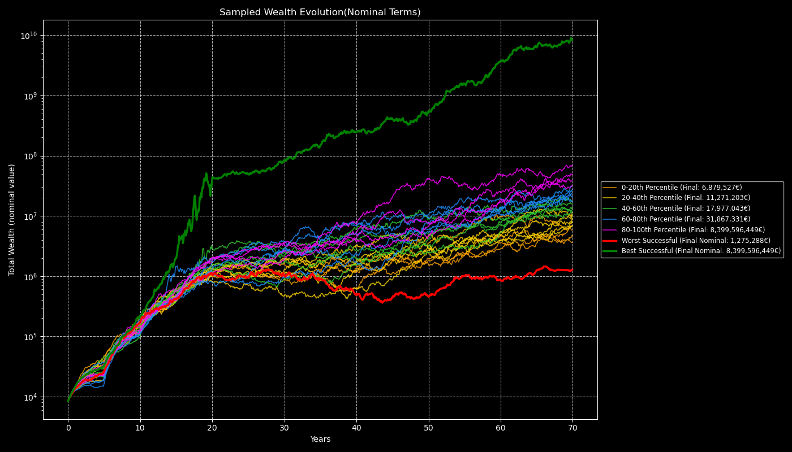
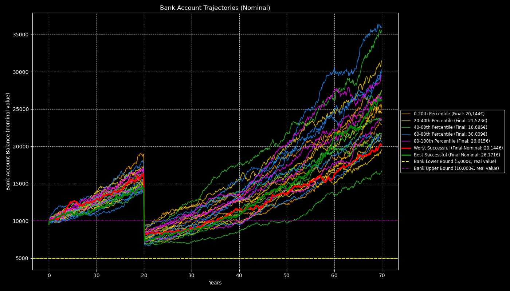
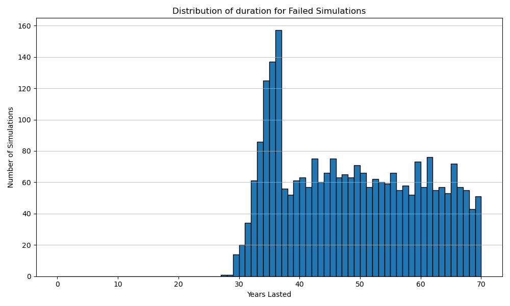
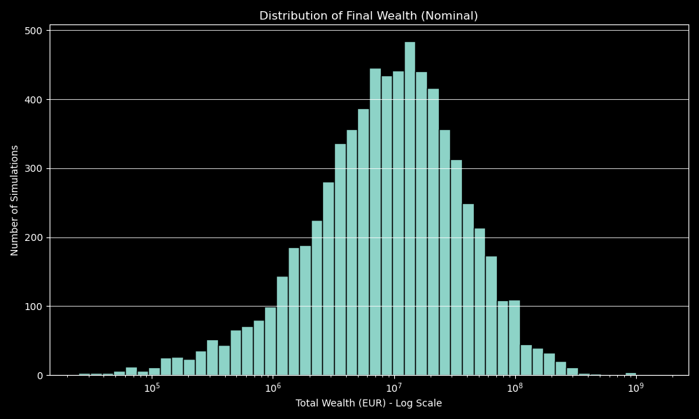

# Firestarter (FIRE Simulation Tool)


---

This project is a Monte Carlo simulation tool for FIRE (Financial Independence / Early Retirement)
planning. It models a user's retirement plan, simulating investment growth, withdrawals, expenses,
and market shocks over time to estimate the probability of financial success.

---

## Purpose

This tool aim to help users understand the likelihood of a retirement plan succeeding under
uncertainty, visualize possible outcomes, and make informed decisions about savings, spending, and
asset allocation.

---

## Key features

- **[Configuration](/docs/configuration_guide.md)**  
  User inputs are provided in TOML files (e.g., `configs/config.toml`). These specify initial
  wealth, income, expenses, assets, assets allocation, economic assumptions (returns, inflation),
  assets and inflation correlation, simulation parameters, portfolio rebalances and market shocks.

  Investment assets are defined in the configuration. For each asset you specify `mu`,
  the sample mean of return rate and `sigma`, the sample standard deviation of return rate.
  You can find these data for a specific period on several online sources, such as
  [Yahoo Finance](https://finance.yahoo.com/), [Investing.com](https://www.investing.com/), [Federal Reserve Economic Data](https://fred.stlouisfed.org/), etc.

  Inflation, although not an asset, is defined in this section because it is correlated
  with assets through a [correlation matrix](/docs/correlation.md), and the mechanism for generating random
  values for assets return and inflation from `mu` and `sigma` is the same.
  The inflation asset is mandatory because it's used to track all the real values, wealth,
  expenses...

  **Example**:

  ```toml
  # Stock parameters based on MSCI World (EUR) annual total returns from 2016-2025
  # MU: Arithmetic Mean
  # SIGMA: Arithmetic Standard Deviation
  # mu = 0.1017
  # sigma = 0.1478
  #
  # The 2016-2025 period was exceptionally strong for global equities
  # For a long-term simulation (30+ years), it's advisable to temper expectations
  # based on very long-term historical averages and current market valuations
  [assets.stocks]
  mu = 0.07
  sigma = 0.15
  is_liquid = true
  withdrawal_priority = 2

  # European Bond parameters based on Bloomberg Euro Aggregate Bond Index (EUR)
  # annual total returns from 2004-2023.
  # MU: Arithmetic Mean
  # SIGMA: Arithmetic Standard Deviation
  # mu = 0.0193
  # sigma = 0.0535
  #
  # The 2004-2023 period includes many years of historically very low and even
  # negative interest rates in Europe. The environment has shifted, and current
  # yields are significantly higher.
  [assets.bonds]
  mu = 0.03
  sigma = 0.055
  is_liquid = true
  withdrawal_priority = 1

  # Inflation parameters based on Eurozone HICP annual inflation rates from 2004-2023.
  # MU: Arithmetic Mean of inflation
  # SIGMA: Arithmetic Standard Deviation of inflation
  # mu = 0.0220
  # sigma = 0.0229
  #
  # More conservative for the future
  [assets.inflation]
  mu = 0.025
  sigma = 0.025
  is_liquid = false
  ```

- **[Simulation Engine](/docs/simulation_engine.md)**

  The main simulation logic, for each run it:

  - Initializes assets values and bank balance
  - Simulates monthly/annual investment returns, inflation
  - Handles withdrawals for expenses and marks the simulation as failed if assets are insufficient
  - Handles salary, pension, contributions, and planned extra expenses
  - Manages liquidity (bank account bounds, topping up or investing excess)
  - Manages portfolio rebalances
  - Applies fees on funds
  - Applies market shocks if configured
  - Optionally simulates a house purchase at a specified time
  - Tracks assets allocation

  Savings: the simulation invest all fund in bank account exceeding the `bank_upper_bound`
  in _"liquid"_ assets.

  **Note**:

  > _The simulation assumes all assets, incomes, expenses, and flows are denominated
  > in a single currency. There is no currency conversion or multi-currency support;
  > all values must be provided and interpreted in the same currency throughout the simulation._
  >
  > _The simulation does not consider any fiscal aspects, therefore parameters such as salary, pension,
  > contributions, etc. are to be considered net of taxes._

- **[Reporting & Plotting](/docs/output.md)**

  - Prints a summary to the console.
  - Generates a report in markdown summarizing the
    simulation results, including links to generated plots.

  [Report example](docs/reports/summary.md).

  - Generates all plots for wealth evolution, bank account
    trajectories, and distributions of outcomes.
  - Output directories for plots and reports are set via the config file and created automatically.

  Plots include:

  Wealth evolution over time
  

  Bank account balance trajectories
  

  Duration distribution of failed cases
  

  Distribution of final wealth for successful outcomes
  

  all the corresponding plots in real terms and others.

---

## Typical Workflow

1. **Configure your plan**

   Edit a TOML file in `configs/` (e.g., `configs/config.toml`), specifying your starting wealth,
   income, expenses, investment strategy, simulation parameters, and any market shocks.
   You can set the output directory root in the `[paths]` section.

2. **[Run the simulation](/docs/usage.md)**

   From the project root, use the provided shell script or Python command:

```shell
./firestarter.sh configs/config.toml
```

or

```shell
export OMP_NUM_THREADS=1
export OPENBLAS_NUM_THREADS=1
export MKL_NUM_THREADS=1
export NUMEXPR_NUM_THREADS=1
python -m firestarter.main configs/config.toml
```

3. **Review the results**
   - **Markdown report**: Generated in `<output_root>/reports/`, summarizing success rate, failed
     simulations, best/worst/average cases, and links to plots.
   - **Plots**: Generated in `<output_root>/plots/`, visualizing wealth evolution, bank account
     trajectories, and distributions.

---

## Configuration Example

```toml
[simulation_parameters]
num_simulations = 10_000
# random_seed = 42

[paths]
output_root = "output/"

[deterministic_inputs]
initial_bank_balance = 8000.0
# To set your initial portfolio, use a planned contribution at year 0 and specify the
# allocation with a rebalance at year 0.
planned_contributions = [{ year = 0, amount = 130000.0 }]

initial_bank_balance = 8000.0

bank_lower_bound = 5000.0
bank_upper_bound = 10000.0

years_to_simulate = 40
# ... (other parameters) ...

[assets.stocks]
mu = 0.07
sigma = 0.15
is_liquid = true
withdrawal_priority = 2

[assets.bonds]
mu = 0.03
sigma = 0.055
is_liquid = true
withdrawal_priority = 1

# Asset inflation must exist.
[assets.inflation]
mu = 0.025
sigma = 0.025
is_liquid = false

[correlation_matrix]
assets_order = ["stocks", "bonds", "inflation"]
# Identity matrix. Indipendent variables, no correlation.
matrix = [
#  stk, bnd, pi
  [1.0, 0.0, 0.0], # stocks
  [0.0, 1.0, 0.0], # bonds
  [0.0, 0.0, 1.0], # inflation
]

[[shocks]]
year = 10
description = "October 1929"
impact = { stocks = -0.35, bonds = 0.02, inflation = -0.023 }

[[portfolio_rebalances]]
year = 0
description = "Initial allocation"
weights = { stocks = 0.80, bonds = 0.20 }

# To set your initial portfolio, use a planned contribution at year 0 and specify
# the allocation with a rebalance at year 0.
# There must always be a rebalance event for year 0 even if a planned contribution
# at year 0 is not specified, the weights are used to allocate all subsequent investments
# until the next rebalance.
[[portfolio_rebalances]]
year = 20
description = "De-risking for retirement"
weights = { stocks = 0.60, bonds = 0.40 }
```

---

## Output

- **Reports**: Markdown files in `<output_root>/reports/` with simulation summary and plot links.
- **Plots**: PNG images in `<output_root>/plots/` for all major simulation results.
- **All output paths are relative to the project root and configurable via `[paths] output_root` in
  your TOML config.**
- See [Output](docs/output.md) for details on the generated files.

---

## Requirements

- Python 3.10+
- See `requirements.txt` for dependencies:
  - numpy, pandas, pandas-stubs, matplotlib, pydantic, tomli, tomli-w, tqdm

Install with:

```sh
pip install -r requirements.txt
```

---

## Running Tests

Tests are in the `tests/` directory, run them with:

```sh
cd fire
pytest
```

---

## Documentation

For mathematical background, advanced usage, and additional guides, see the [docs/](docs/) folder.

### 📃 Documentation Index

- [Installation Guide](docs/install.md): Step-by-step instructions for installing firestarter from a
  GitHub release.
- [Configuration Reference](docs/config.md): Detailed explanation of all configuration parameters.
- [Usage Guide](docs/usage.md): How to install, configure, and run the simulation.
- [Results](docs/output.md): Detailed explanation of all outputs of the simulation.
- [Monte Carlo Theory](docs/montecarlo.md): Mathematical background and simulation theory.

**For more details, see the docstrings in each module.**

## 📚 Further Readings

- **Books**:

  - _The Bogleheads’ Guide to Investing_ by Taylor Larimore, Mel Lindauer, and Michael LeBoeuf:
    A practical guide to low-cost investing and financial independence, covering asset
    allocation and risk management.
  - _Quantitative Finance for Dummies_ by Steve Bell: An accessible introduction to
    financial modeling, including Monte Carlo simulations and volatility.
  - _The Millionaire Next Door_ by Thomas J. Stanley and William D. Danko: insights
    into wealth-building habits and strategies for financial independence.

- **Online Resources**:

  - [Early Retirement Now](https://earlyretirementnow.com/): A detailed blog on FIRE strategies.
  - [Bogleheads Wiki](https://www.bogleheads.org/wiki/Main_Page): A comprehensive resource on investing, retirement planning
    and portfolio management, with a focus on low-cost, passive strategies.
  - [Investopedia: Monte Carlo Simulation](https://www.investopedia.com/terms/m/montecarlosimulation.asp): A clear explanation of Monte Carlo
    methods in financial planning and risk analysis.

- **Academic/Technical**:

  - _Monte Carlo Methods in Financial Engineering_ by Paul Glasserman: A rigorous text
    on Monte Carlo techniques for financial modeling, including asset return simulations.
  - _Options, Futures, and Other Derivatives_ by John C. Hull: A foundational text on
    derivatives pricing, volatility modeling, and Monte Carlo simulations, ideal for
    understanding asset return dynamics.
  - [Investopedia: Asset Return Volatility](https://www.investopedia.com/terms/v/volatility.asp): Explains volatility as the standard deviation
    of returns, key for configuring your `mu` and `sigma` parameters.

- **Communities**:
  - [r/financialindependence](https://www.reddit.com/r/financialindependence/): A Reddit community discussing FIRE strategies, with real-world
    insights and case studies.

These resources provide a mix of practical, theoretical, and data-driven content to enhance your use of this tool and FIRE planning knowledge.
