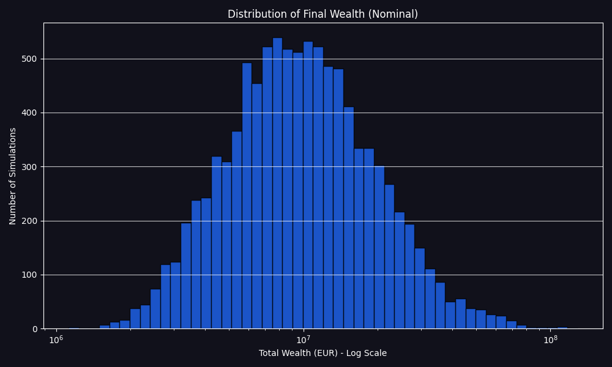

# FIRE Plan Simulation Report

Report generated on: 2025-07-26 16:25:11
Using configuration: `config.toml`

## FIRE Plan Simulation Summary

- **FIRE Plan Success Rate:** 99.18%
- **Number of failed simulations:** 82
- **Average months lasted in failed simulations:** 209.0

## Final Wealth Distribution Statistics (Successful Simulations)

| Statistic                     | Nominal Final Wealth          | Real Final Wealth (Today's Money) |
|-------------------------------|-------------------------------|-----------------------------------|
| Median (P50)                  | 13,982,998.30  | 2,538,218.88         |
| 25th Percentile (P25)         | 7,771,846.63     | 1,381,654.68            |
| 75th Percentile (P75)         | 26,900,633.18     | 4,961,089.74            |
| Interquartile Range (P75-P25) | 19,128,786.55     | 3,579,435.06            |

## Nominal Results (cases selected by nominal final wealth)

#### Worst Successful Case (Nominal)

- **Final Wealth (Nominal):** 1,286,663.33
- **Final Wealth (Real):** 242,972.05
- **Cumulative Inflation Factor:** 5.2955
- **Your life CAGR (Nominal):** 7.53%
- **Final Allocations (percent):** stocks: 49.0%, bonds: 51.0%, str: 0.0%, eth: 0.0%, ag: 0.0%, real_estate: 0.0%
- **Nominal Asset Values:** stocks: 605,093.52 , bonds: 628,614.61 , str: 0.00 , eth: 0.00 , ag: 0.00 , real_estate: 0.00 , Bank: 52,955.20

#### Median Successful Case (Nominal)

- **Final Wealth (Nominal):** 13,983,187.27
- **Final Wealth (Real):** 2,666,273.85
- **Cumulative Inflation Factor:** 5.2445
- **Your life CAGR (Nominal):** 11.26%
- **Final Allocations (percent):** stocks: 96.0%, bonds: 4.0%, str: 0.0%, eth: 0.0%, ag: 0.0%, real_estate: 0.0%
- **Nominal Asset Values:** stocks: 13,372,449.10 , bonds: 558,293.49 , str: 0.00 , eth: 0.00 , ag: 0.00 , real_estate: 0.00 , Bank: 52,444.68

#### Best Successful Case (Nominal)

- **Final Wealth (Nominal):** 1,759,017,738.80
- **Final Wealth (Real):** 410,403,135.94
- **Cumulative Inflation Factor:** 4.2861
- **Your life CAGR (Nominal):** 19.21%
- **Final Allocations (percent):** stocks: 94.2%, bonds: 5.8%, str: 0.0%, eth: 0.0%, ag: 0.0%, real_estate: 0.0%
- **Nominal Asset Values:** stocks: 1,657,192,172.88 , bonds: 101,782,705.20 , str: 0.00 , eth: 0.00 , ag: 0.00 , real_estate: 0.00 , Bank: 42,860.73

## Real Results (cases selected by real final wealth)

#### Worst Successful Case (Real)

- **Final Wealth (Real):** 180,453.56
- **Final Wealth (Nominal):** 1,452,048.46
- **Cumulative Inflation Factor:** 8.0467
- **Your life CAGR (Real):** 4.55%
- **Final Allocations (percent):** stocks: 53.5%, bonds: 46.5%, str: 0.0%, eth: 0.0%, ag: 0.0%, real_estate: 0.0%
- **Nominal Asset Values:** stocks: 734,217.05 , bonds: 637,364.80 , str: 0.00 , eth: 0.00 , ag: 0.00 , real_estate: 0.00 , Bank: 80,466.60

#### Median Successful Case (Real)

- **Final Wealth (Real):** 2,538,877.30
- **Final Wealth (Nominal):** 10,684,805.85
- **Cumulative Inflation Factor:** 4.2085
- **Your life CAGR (Real):** 8.58%
- **Final Allocations (percent):** stocks: 91.2%, bonds: 8.8%, str: 0.0%, eth: 0.0%, ag: 0.0%, real_estate: 0.0%
- **Nominal Asset Values:** stocks: 9,708,237.99 , bonds: 934,483.10 , str: 0.00 , eth: 0.00 , ag: 0.00 , real_estate: 0.00 , Bank: 42,084.77

#### Best Successful Case (Real)

- **Final Wealth (Real):** 410,403,135.94
- **Final Wealth (Nominal):** 1,759,017,738.80
- **Cumulative Inflation Factor:** 4.2861
- **Your life CAGR (Real):** 16.76%
- **Final Allocations (percent):** stocks: 94.2%, bonds: 5.8%, str: 0.0%, eth: 0.0%, ag: 0.0%, real_estate: 0.0%
- **Nominal Asset Values:** stocks: 1,657,192,172.88 , bonds: 101,782,705.20 , str: 0.00 , eth: 0.00 , ag: 0.00 , real_estate: 0.00 , Bank: 42,860.73

## Visualizations

### Failed Duration Distribution


### Final Wealth Distribution (Nominal)



### Final Wealth Distribution (Real)


### Wealth Evolution Samples (Real)


### Wealth Evolution Samples (Nominal)


### Failed Wealth Evolution Samples (Real)


### Failed Wealth Evolution Samples (Nominal)


### Bank Account Trajectories (Real)


### Bank Account Trajectories (Nominal)


### Loaded Configuration Parameters

```toml
[assets.stocks]
mu = 0.07
sigma = 0.15
is_liquid = true
withdrawal_priority = 2

[assets.bonds]
mu = 0.03
sigma = 0.055
is_liquid = true
withdrawal_priority = 1

[assets.str]
mu = 0.0152
sigma = 0.0181
is_liquid = true
withdrawal_priority = 0

[assets.eth]
mu = 0.25
sigma = 0.9
is_liquid = true
withdrawal_priority = 3

[assets.ag]
mu = 0.07
sigma = 0.32
is_liquid = true
withdrawal_priority = 4

[assets.real_estate]
mu = -0.0054
sigma = 0.0416
is_liquid = false

[assets.inflation]
mu = 0.025
sigma = 0.025
is_liquid = false

[deterministic_inputs]
initial_bank_balance = 8000.0
bank_lower_bound = 5000.0
bank_upper_bound = 10000.0
years_to_simulate = 70
monthly_income_steps = [
    { year = 0, monthly_amount = 4000.0 },
    { year = 5, monthly_amount = 5000.0 },
    { year = 10, monthly_amount = 7000.0 },
    { year = 15, monthly_amount = 10000.0 },
]
income_inflation_factor = 0.6
income_end_year = 20
monthly_pension = 4000.0
pension_inflation_factor = 0.75
pension_start_year = 37
planned_contributions = []
annual_fund_fee = 0.0015
monthly_expenses_steps = [
    { year = 0, monthly_amount = 3500.0 },
    { year = 20, monthly_amount = 3000.0 },
    { year = 37, monthly_amount = 2500.0 },
    { year = 50, monthly_amount = 1500.0 },
]
planned_extra_expenses = [
    { amount = 30000.0, year = 20, description = "Buy a car" },
]

[correlation_matrix]
assets_order = [
    "stocks",
    "bonds",
    "str",
    "eth",
    "ag",
    "real_estate",
    "inflation",
]
matrix = [
    [1.0, 0.0, 0.0, 0.0, 0.0, 0.0, 0.0],
    [0.0, 1.0, 0.0, 0.0, 0.0, 0.0, 0.0],
    [0.0, 0.0, 1.0, 0.0, 0.0, 0.0, 0.0],
    [0.0, 0.0, 0.0, 1.0, 0.0, 0.0, 0.0],
    [0.0, 0.0, 0.0, 0.0, 1.0, 0.0, 0.0],
    [0.0, 0.0, 0.0, 0.0, 0.0, 1.0, 0.0],
    [0.0, 0.0, 0.0, 0.0, 0.0, 0.0, 1.0],
]

[[portfolio_rebalances]]
year = 0
description = "start allocation"

[portfolio_rebalances.weights]
stocks = 0.8
bonds = 0.15
eth = 0.025
ag = 0.025

[[portfolio_rebalances]]
year = 20
description = "De-risking for retirement"

[portfolio_rebalances.weights]
stocks = 0.6
bonds = 0.4

[simulation_parameters]
num_simulations = 10000

[paths]
output_root = "output/"

```

---
Generated by firestarter FIRE Plan Monte Carlo simulation
