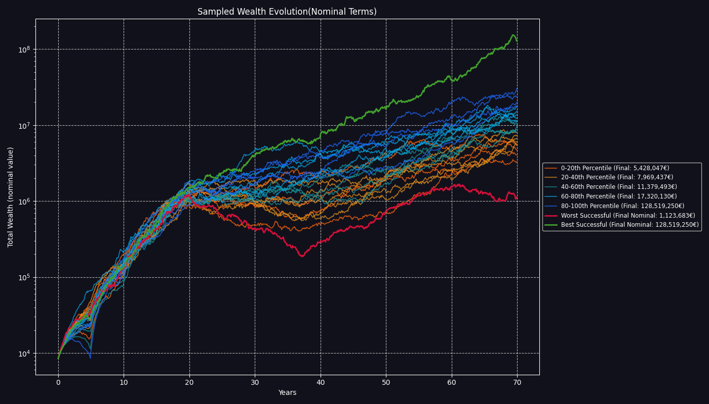

# FIRE Plan Simulation Report

Report generated on: 2025-08-13 13:21:44
Using configuration: `config.toml`

## FIRE Plan Simulation Summary

- **FIRE Plan Success Rate:** 99.19%
- **Number of failed simulations:** 81
- **Average months lasted in failed simulations:** 218.4

## Final Wealth Distribution Statistics (Successful Simulations)

| Statistic                     | Nominal Final Wealth          | Real Final Wealth (Today's Money) |
|-------------------------------|-------------------------------|-----------------------------------|
| Median (P50)                  | 14,116,200.96  | 2,586,190.49         |
| 25th Percentile (P25)         | 7,661,270.52     | 1,385,182.95            |
| 75th Percentile (P75)         | 27,328,971.65     | 5,013,385.44            |
| Interquartile Range (P75-P25) | 19,667,701.13     | 3,628,202.48            |

## Nominal Results (cases selected by nominal final wealth)

### Worst Successful Case (Nominal)

- **Final Wealth (Nominal):** 1,395,709.53
- **Final Wealth (Real):** 263,714.38
- **Cumulative Inflation Factor:** 5.2925
- **Your life CAGR (Nominal):** 7.65%
- **Final Allocations (percent):** stocks: 57.1%, bonds: 42.9%, str: 0.0%, eth: 0.0%, ag: 0.0%
- **Nominal Asset Values:** stocks: 766,453.38 , bonds: 576,331.10 , str: 0.00 , eth: 0.00 , ag: 0.00 , Bank: 52,925.04

### Median Successful Case (Nominal)

- **Final Wealth (Nominal):** 14,116,200.96
- **Final Wealth (Real):** 2,700,326.24
- **Cumulative Inflation Factor:** 5.2276
- **Your life CAGR (Nominal):** 11.27%
- **Final Allocations (percent):** stocks: 95.3%, bonds: 4.7%, str: 0.0%, eth: 0.0%, ag: 0.0%
- **Nominal Asset Values:** stocks: 13,404,799.64 , bonds: 659,125.42 , str: 0.00 , eth: 0.00 , ag: 0.00 , Bank: 52,275.91

### Best Successful Case (Nominal)

- **Final Wealth (Nominal):** 1,369,511,002.18
- **Final Wealth (Real):** 205,082,146.73
- **Cumulative Inflation Factor:** 6.6779
- **Your life CAGR (Nominal):** 18.79%
- **Final Allocations (percent):** stocks: 89.0%, bonds: 11.0%, str: 0.0%, eth: 0.0%, ag: 0.0%
- **Nominal Asset Values:** stocks: 1,219,075,319.23 , bonds: 150,368,904.29 , str: 0.00 , eth: 0.00 , ag: 0.00 , Bank: 66,778.66

## Real Results (cases selected by real final wealth)

### Worst Successful Case (Real)

- **Final Wealth (Real):** 218,759.13
- **Final Wealth (Nominal):** 1,574,487.99
- **Cumulative Inflation Factor:** 7.1974
- **Your life CAGR (Real):** 4.84%
- **Final Allocations (percent):** stocks: 54.8%, bonds: 45.2%, str: 0.0%, eth: 0.0%, ag: 0.0%
- **Nominal Asset Values:** stocks: 823,774.24 , bonds: 678,740.16 , str: 0.00 , eth: 0.00 , ag: 0.00 , Bank: 71,973.59

### Median Successful Case (Real)

- **Final Wealth (Real):** 2,586,190.49
- **Final Wealth (Nominal):** 11,834,409.18
- **Cumulative Inflation Factor:** 4.5760
- **Your life CAGR (Real):** 8.61%
- **Final Allocations (percent):** stocks: 94.9%, bonds: 5.1%, str: 0.0%, eth: 0.0%, ag: 0.0%
- **Nominal Asset Values:** stocks: 11,190,637.25 , bonds: 598,011.92 , str: 0.00 , eth: 0.00 , ag: 0.00 , Bank: 45,760.01

### Best Successful Case (Real)

- **Final Wealth (Real):** 205,082,146.73
- **Final Wealth (Nominal):** 1,369,511,002.18
- **Cumulative Inflation Factor:** 6.6779
- **Your life CAGR (Real):** 15.61%
- **Final Allocations (percent):** stocks: 89.0%, bonds: 11.0%, str: 0.0%, eth: 0.0%, ag: 0.0%
- **Nominal Asset Values:** stocks: 1,219,075,319.23 , bonds: 150,368,904.29 , str: 0.00 , eth: 0.00 , ag: 0.00 , Bank: 66,778.66

## Visualizations

### Failed Duration Distribution


### Final Wealth Distribution (Nominal)


### Final Wealth Distribution (Real)


### Wealth Evolution Samples (Real)


### Wealth Evolution Samples (Nominal)



### Failed Wealth Evolution Samples (Real)


### Failed Wealth Evolution Samples (Nominal)


### Bank Account Trajectories (Real)


### Bank Account Trajectories (Nominal)


### Loaded Configuration Parameters

```toml
[assets.stocks]
mu = 0.07
sigma = 0.15
withdrawal_priority = 2

[assets.bonds]
mu = 0.03
sigma = 0.055
withdrawal_priority = 1

[assets.str]
mu = 0.0152
sigma = 0.0181
withdrawal_priority = 0

[assets.eth]
mu = 0.25
sigma = 0.9
withdrawal_priority = 3

[assets.ag]
mu = 0.07
sigma = 0.32
withdrawal_priority = 4

[assets.inflation]
mu = 0.025
sigma = 0.025

[deterministic_inputs]
initial_bank_balance = 8000.0
bank_lower_bound = 5000.0
bank_upper_bound = 10000.0
years_to_simulate = 70
monthly_income_steps = [
    { year = 0, monthly_amount = 4000.0 },
    { year = 5, monthly_amount = 5000.0 },
    { year = 10, monthly_amount = 7000.0 },
    { year = 15, monthly_amount = 10000.0 },
]
income_inflation_factor = 0.6
income_end_year = 20
monthly_pension = 4000.0
pension_inflation_factor = 0.75
pension_start_year = 37
planned_contributions = []
annual_fund_fee = 0.0015
monthly_expenses_steps = [
    { year = 0, monthly_amount = 3500.0 },
    { year = 20, monthly_amount = 3000.0 },
    { year = 37, monthly_amount = 2500.0 },
    { year = 50, monthly_amount = 1500.0 },
]
planned_extra_expenses = [
    { amount = 30000.0, year = 20, description = "Buy a car" },
]

[correlation_matrix]
assets_order = [
    "stocks",
    "bonds",
    "str",
    "eth",
    "ag",
    "inflation",
]
matrix = [
    [1.0, 0.0, 0.0, 0.0, 0.0, 0.0],
    [0.0, 1.0, 0.0, 0.0, 0.0, 0.0],
    [0.0, 0.0, 1.0, 0.0, 0.0, 0.0],
    [0.0, 0.0, 0.0, 1.0, 0.0, 0.0],
    [0.0, 0.0, 0.0, 0.0, 1.0, 0.0],
    [0.0, 0.0, 0.0, 0.0, 0.0, 1.0],
]

[[portfolio_rebalances]]
year = 0
description = "start allocation"

[portfolio_rebalances.weights]
stocks = 0.8
bonds = 0.15
eth = 0.025
ag = 0.025

[[portfolio_rebalances]]
year = 20
description = "De-risking for retirement"

[portfolio_rebalances.weights]
stocks = 0.6
bonds = 0.4

[simulation_parameters]
num_simulations = 10000

[paths]
output_root = "output/"

```

---
Generated by firestarter FIRE Plan Monte Carlo simulation
