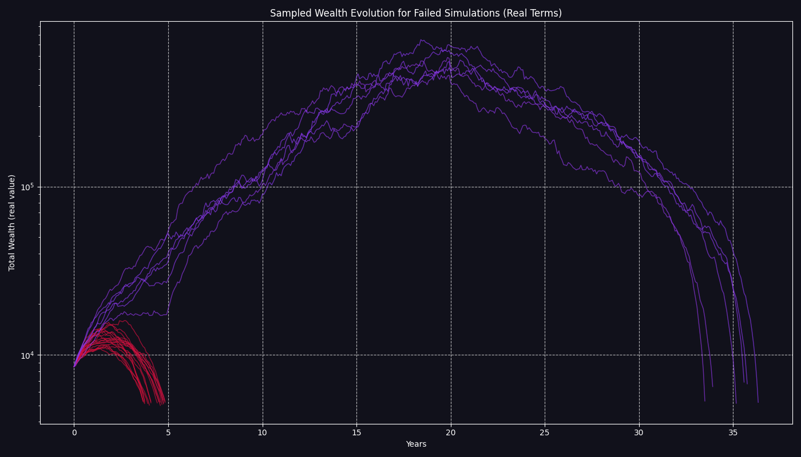

# FIRE Plan Simulation Report

Report generated on: 2025-07-24 12:20:42
Using configuration: `config.toml`

## FIRE Plan Simulation Summary

- **FIRE Plan Success Rate:** 70.15%
- **Number of failed simulations:** 2985
- **Average months lasted in failed simulations:** 578.5

## Final Wealth Distribution Statistics (Successful Simulations)

| Statistic                     | Nominal Final Wealth          | Real Final Wealth (Today's Money) |
|-------------------------------|-------------------------------|-----------------------------------|
| Median (P50)                  | 9,477,741.48  | 1,762,743.87         |
| 25th Percentile (P25)         | 3,600,072.23     | 678,297.13            |
| 75th Percentile (P75)         | 22,380,777.30     | 4,336,351.09            |
| Interquartile Range (P75-P25) | 18,780,705.07     | 3,658,053.95            |

## Nominal Results (cases selected by nominal final wealth)

#### Worst Successful Case (Nominal)

- **Final Wealth (Nominal):** 24,790.71
- **Final Wealth (Real):** 6,153.34
- **Your life CAGR (Nominal):** 1.63%
- **Final Allocations (percent):** stocks: 100.0%, bonds: 0.0%, str: 0.0%, eth: 0.0%, ag: 0.0%, real_estate: 0.0%, inflation: 0.0%
- **Nominal Asset Values:** stocks: 4,646.59 , bonds: 0.00 , str: 0.00 , eth: 0.00 , ag: 0.00 , real_estate: 0.00 , inflation: 0.00 , Bank: 20,144.12

#### Median Successful Case (Nominal)

- **Final Wealth (Nominal):** 9,477,741.48
- **Final Wealth (Real):** 2,181,489.57
- **Your life CAGR (Nominal):** 10.64%
- **Final Allocations (percent):** stocks: 100.0%, bonds: 0.0%, str: 0.0%, eth: 0.0%, ag: 0.0%, real_estate: 0.0%, inflation: 0.0%
- **Nominal Asset Values:** stocks: 9,456,018.38 , bonds: 0.00 , str: 0.00 , eth: 0.00 , ag: 0.00 , real_estate: 0.00 , inflation: 0.00 , Bank: 21,723.10

#### Best Successful Case (Nominal)

- **Final Wealth (Nominal):** 1,561,374,224.98
- **Final Wealth (Real):** 298,305,313.59
- **Your life CAGR (Nominal):** 19.01%
- **Final Allocations (percent):** stocks: 97.6%, bonds: 2.4%, str: 0.0%, eth: 0.0%, ag: 0.0%, real_estate: 0.0%, inflation: 0.0%
- **Nominal Asset Values:** stocks: 1,523,933,739.48 , bonds: 37,414,314.76 , str: 0.00 , eth: 0.00 , ag: 0.00 , real_estate: 0.00 , inflation: 0.00 , Bank: 26,170.74

## Real Results (cases selected by real final wealth)

#### Worst Successful Case (Real)

- **Final Wealth (Real):** 5,298.27
- **Final Wealth (Nominal):** 28,576.10
- **Your life CAGR (Real):** -0.59%
- **Final Allocations (percent):** stocks: 100.0%, bonds: 0.0%, str: 0.0%, eth: 0.0%, ag: 0.0%, real_estate: 0.0%, inflation: 0.0%
- **Nominal Asset Values:** stocks: 1,608.71 , bonds: 0.00 , str: 0.00 , eth: 0.00 , ag: 0.00 , real_estate: 0.00 , inflation: 0.00 , Bank: 26,967.39

#### Median Successful Case (Real)

- **Final Wealth (Real):** 1,762,743.87
- **Final Wealth (Nominal):** 10,899,607.97
- **Your life CAGR (Real):** 8.01%
- **Final Allocations (percent):** stocks: 100.0%, bonds: 0.0%, str: 0.0%, eth: 0.0%, ag: 0.0%, real_estate: 0.0%, inflation: 0.0%
- **Nominal Asset Values:** stocks: 10,868,691.37 , bonds: 0.00 , str: 0.00 , eth: 0.00 , ag: 0.00 , real_estate: 0.00 , inflation: 0.00 , Bank: 30,916.60

#### Best Successful Case (Real)

- **Final Wealth (Real):** 298,305,313.59
- **Final Wealth (Nominal):** 1,561,374,224.98
- **Your life CAGR (Real):** 16.23%
- **Final Allocations (percent):** stocks: 97.6%, bonds: 2.4%, str: 0.0%, eth: 0.0%, ag: 0.0%, real_estate: 0.0%, inflation: 0.0%
- **Nominal Asset Values:** stocks: 1,523,933,739.48 , bonds: 37,414,314.76 , str: 0.00 , eth: 0.00 , ag: 0.00 , real_estate: 0.00 , inflation: 0.00 , Bank: 26,170.74

## Visualizations

### Failed Duration Distribution


### Final Wealth Distribution (Nominal)


### Final Wealth Distribution (Real)


### Wealth Evolution Samples (Real)


### Wealth Evolution Samples (Nominal)


### Failed Wealth Evolution Samples (Real)



### Failed Wealth Evolution Samples (Nominal)


### Bank Account Trajectories (Real)


### Bank Account Trajectories (Nominal)


### Loaded Configuration Parameters

```toml
[assets.stocks]
mu = 0.07
sigma = 0.15
is_liquid = true
withdrawal_priority = 2

[assets.bonds]
mu = 0.03
sigma = 0.055
is_liquid = true
withdrawal_priority = 1

[assets.str]
mu = 0.0152
sigma = 0.0181
is_liquid = true
withdrawal_priority = 0

[assets.eth]
mu = 0.25
sigma = 0.9
is_liquid = true
withdrawal_priority = 3

[assets.ag]
mu = 0.07
sigma = 0.32
is_liquid = true
withdrawal_priority = 4

[assets.real_estate]
mu = -0.0054
sigma = 0.0416
is_liquid = false

[assets.inflation]
mu = 0.025
sigma = 0.025
is_liquid = false

[deterministic_inputs]
initial_bank_balance = 8000.0
bank_lower_bound = 5000.0
bank_upper_bound = 10000.0
years_to_simulate = 70
monthly_salary_steps = [
    { year = 0, monthly_amount = 4000.0 },
    { year = 5, monthly_amount = 5000.0 },
    { year = 10, monthly_amount = 7000.0 },
    { year = 15, monthly_amount = 10000.0 },
]
salary_inflation_factor = 0.6
salary_end_year = 20
monthly_pension = 4000.0
pension_inflation_factor = 0.6
pension_start_year = 37
planned_contributions = [
    { amount = 0.0, year = 0 },
]
annual_fund_fee = 0.0015
monthly_expenses = 2500.0
planned_extra_expenses = [
    { amount = 30000.0, year = 37, description = "Buy a car" },
]
planned_house_purchase_cost = 0.0
house_purchase_year = 0

[correlation_matrix]
assets_order = [
    "stocks",
    "bonds",
    "str",
    "eth",
    "ag",
    "real_estate",
    "inflation",
]
matrix = [
    [1.0, 0.0, 0.0, 0.0, 0.0, 0.0, 0.0],
    [0.0, 1.0, 0.0, 0.0, 0.0, 0.0, 0.0],
    [0.0, 0.0, 1.0, 0.0, 0.0, 0.0, 0.0],
    [0.0, 0.0, 0.0, 1.0, 0.0, 0.0, 0.0],
    [0.0, 0.0, 0.0, 0.0, 1.0, 0.0, 0.0],
    [0.0, 0.0, 0.0, 0.0, 0.0, 1.0, 0.0],
    [0.0, 0.0, 0.0, 0.0, 0.0, 0.0, 1.0],
]

[[portfolio_rebalances]]
year = 0
description = "start allocation"

[portfolio_rebalances.weights]
stocks = 0.8
bonds = 0.15
eth = 0.025
ag = 0.025

[[portfolio_rebalances]]
year = 20
description = "De-risking for retirement"

[portfolio_rebalances.weights]
stocks = 0.6
bonds = 0.4

[simulation_parameters]
num_simulations = 10000

[paths]
output_root = "output/"

```

---
Generated by firestarter FIRE Plan Monte Carlo simulation
