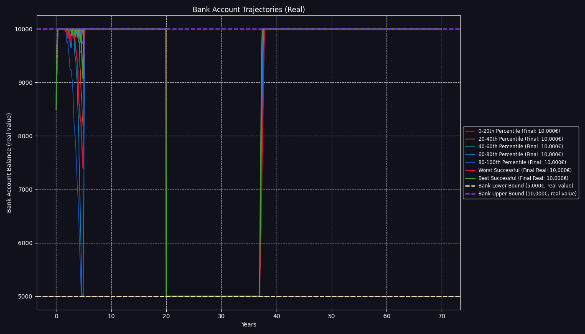
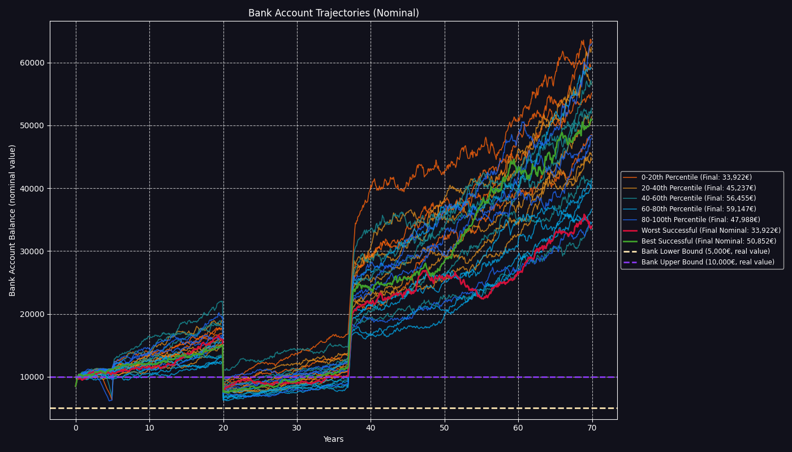

# FIRE Plan Simulation Report

Report generated on: 2025-07-18 19:14:18
Using configuration: `config.toml`

## FIRE Plan Simulation Summary

- **FIRE Plan Success Rate:** 73.53%
- **Number of failed simulations:** 2647
- **Average months lasted in failed simulations:** 583.6

## Final Wealth Distribution Statistics (Successful Simulations)

| Statistic                     | Nominal Final Wealth | Real Final Wealth (Today's Money) |
| ----------------------------- | -------------------- | --------------------------------- |
| Median (P50)                  | 10,053,670.41        | 1,961,863.82                      |
| 25th Percentile (P25)         | 3,737,646.84         | 723,917.64                        |
| 75th Percentile (P75)         | 24,909,933.61        | 4,961,694.15                      |
| Interquartile Range (P75-P25) | 21,172,286.77        | 4,237,776.50                      |

## Nominal Results (cases selected by nominal final wealth)

#### Worst Successful Case (Nominal)

- **Final Wealth (Nominal):** 23,552.26
- **Final Wealth (Real):** 5,779.24
- **Your life CAGR (Nominal):** -3.39%
- **Final Allocations (percent):** stocks: 100.0%, bonds: 0.0%, str: 0.0%, eth: 0.0%, ag: 0.0%, real_estate: 0.0%
- **Nominal Asset Values:** stocks: 3,175.64 , bonds: 0.00 , str: 0.00 , eth: 0.00 , ag: 0.00 , real_estate: 0.00 , Bank: 20,376.61

#### Median Successful Case (Nominal)

- **Final Wealth (Nominal):** 10,053,670.41
- **Final Wealth (Real):** 2,251,563.26
- **Your life CAGR (Nominal):** 5.34%
- **Final Allocations (percent):** stocks: 100.0%, bonds: 0.0%, str: 0.0%, eth: 0.0%, ag: 0.0%, real_estate: 0.0%
- **Nominal Asset Values:** stocks: 10,031,344.44 , bonds: 0.00 , str: 0.00 , eth: 0.00 , ag: 0.00 , real_estate: 0.00 , Bank: 22,325.98

#### Best Successful Case (Nominal)

- **Final Wealth (Nominal):** 105,583,739,399.30
- **Final Wealth (Real):** 23,541,937,647.10
- **Your life CAGR (Nominal):** 20.24%
- **Final Allocations (percent):** stocks: 94.8%, bonds: 5.2%, str: 0.0%, eth: 0.0%, ag: 0.0%, real_estate: 0.0%
- **Nominal Asset Values:** stocks: 100,082,782,938.91 , bonds: 5,500,934,035.78 , str: 0.00 , eth: 0.00 , ag: 0.00 , real_estate: 0.00 , Bank: 22,424.61

## Real Results (cases selected by real final wealth)

#### Worst Successful Case (Real)

- **Final Wealth (Real):** 5,045.05
- **Final Wealth (Nominal):** 31,537.15
- **Your life CAGR (Real):** -5.49%
- **Final Allocations (percent):** stocks: 100.0%, bonds: 0.0%, str: 0.0%, eth: 0.0%, ag: 0.0%, real_estate: 0.0%
- **Nominal Asset Values:** stocks: 281.62 , bonds: 0.00 , str: 0.00 , eth: 0.00 , ag: 0.00 , real_estate: 0.00 , Bank: 31,255.53

#### Median Successful Case (Real)

- **Final Wealth (Real):** 1,961,863.82
- **Final Wealth (Nominal):** 9,908,430.19
- **Your life CAGR (Real):** 2.91%
- **Final Allocations (percent):** stocks: 100.0%, bonds: 0.0%, str: 0.0%, eth: 0.0%, ag: 0.0%, real_estate: 0.0%
- **Nominal Asset Values:** stocks: 9,883,177.59 , bonds: 0.00 , str: 0.00 , eth: 0.00 , ag: 0.00 , real_estate: 0.00 , Bank: 25,252.59

#### Best Successful Case (Real)

- **Final Wealth (Real):** 23,541,937,647.10
- **Final Wealth (Nominal):** 105,583,739,399.30
- **Your life CAGR (Real):** 17.69%
- **Final Allocations (percent):** stocks: 94.8%, bonds: 5.2%, str: 0.0%, eth: 0.0%, ag: 0.0%, real_estate: 0.0%
- **Nominal Asset Values:** stocks: 100,082,782,938.91 , bonds: 5,500,934,035.78 , str: 0.00 , eth: 0.00 , ag: 0.00 , real_estate: 0.00 , Bank: 22,424.61

## Visualizations

### Retirement Duration Distribution


### Final Wealth Distribution (Nominal)


### Final Wealth Distribution (Real)


### Wealth Evolution Samples (Real)


### Wealth Evolution Samples (Nominal)


### Failed Wealth Evolution Samples (Real)


### Failed Wealth Evolution Samples (Nominal)


### Bank Account Trajectories (Real)



### Bank Account Trajectories (Nominal)



### Loaded Configuration Parameters

```toml
[assets.stocks]
mu = 0.07
sigma = 0.15
is_liquid = true
withdrawal_priority = 2

[assets.bonds]
mu = 0.03
sigma = 0.055
is_liquid = true
withdrawal_priority = 1

[assets.str]
mu = 0.0152
sigma = 0.0181
is_liquid = true
withdrawal_priority = 0

[assets.eth]
mu = 0.25
sigma = 0.9
is_liquid = true
withdrawal_priority = 3

[assets.ag]
mu = 0.07
sigma = 0.32
is_liquid = true
withdrawal_priority = 4

[assets.real_estate]
mu = -0.0054
sigma = 0.0416
is_liquid = false

[assets.inflation]
mu = 0.025
sigma = 0.025
is_liquid = false

[deterministic_inputs]
initial_bank_balance = 8000.0
bank_lower_bound = 5000.0
bank_upper_bound = 10000.0
years_to_simulate = 70
monthly_salary = 4000.0
salary_inflation_factor = 1.01
salary_start_year = 0
salary_end_year = 20
monthly_pension = 4000.0
pension_inflation_factor = 0.6
pension_start_year = 37
planned_contributions = [
    { amount = 20000.0, year = 5 },
    { amount = 20000.0, year = 10 },
    { amount = 10000.0, year = 15 },
]
annual_fund_fee = 0.0015
monthly_expenses = 2500.0
planned_extra_expenses = [
    { amount = 30000.0, year = 20, description = "Buy a car" },
]
planned_house_purchase_cost = 0.0
house_purchase_year = 0

[deterministic_inputs.initial_portfolio]
stocks = 200000.0
bonds = 20000.0
str = 15000.0
eth = 10000.0
ag = 10000.0
real_estate = 0.0

[correlation_matrix]
assets_order = [
    "stocks",
    "bonds",
    "str",
    "eth",
    "ag",
    "real_estate",
    "inflation",
]
matrix = [
    [1.0, 0.0, 0.0, 0.0, 0.0, 0.0, 0.0],
    [0.0, 1.0, 0.0, 0.0, 0.0, 0.0, 0.0],
    [0.0, 0.0, 1.0, 0.0, 0.0, 0.0, 0.0],
    [0.0, 0.0, 0.0, 1.0, 0.0, 0.0, 0.0],
    [0.0, 0.0, 0.0, 0.0, 1.0, 0.0, 0.0],
    [0.0, 0.0, 0.0, 0.0, 0.0, 1.0, 0.0],
    [0.0, 0.0, 0.0, 0.0, 0.0, 0.0, 1.0],
]

[[portfolio_rebalances]]
year = 20
description = "De-risking for retirement"

[portfolio_rebalances.weights]
stocks = 0.6
bonds = 0.4

[simulation_parameters]
num_simulations = 10000

[[shocks]]
year = 10
description = "October 1929"

[shocks.impact]
stocks = -0.35
bonds = 0.02
inflation = -0.023

[paths]
output_root = "output/"

```

---

Generated by firestarter FIRE Plan Monte Carlo simulation
